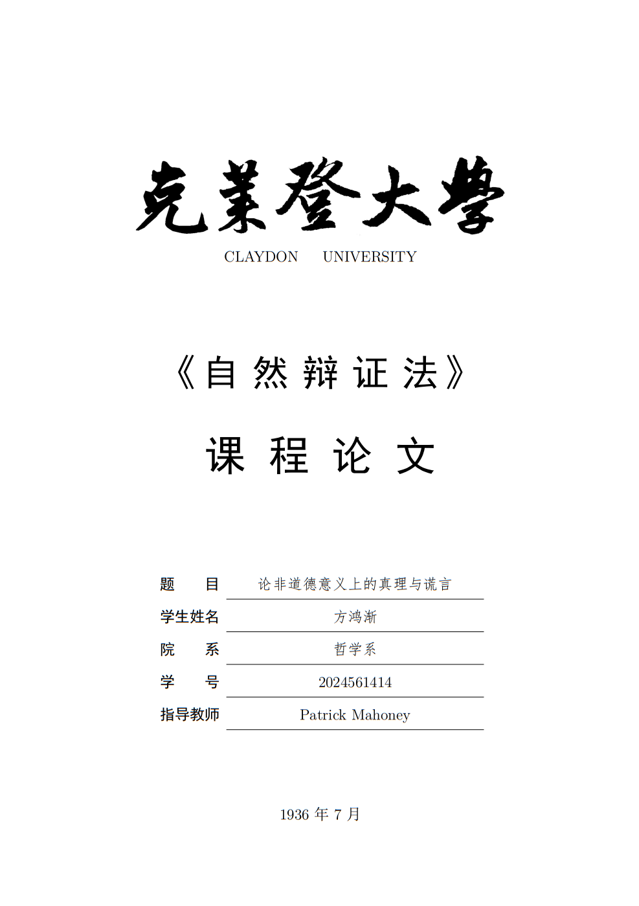

# LaTeX Template: Essay

Except as expressly indicated, any resemblance to real-life entities in this sample is purely coincidental.

In this sample, the inscription in [claydon-univ-zhaomengfu.png](./img/claydon-univ-zhaomengfu.png) is collected from the work of Zhao Mengfu; title of the essay and the cited thesis are from the work of Friedrich Nietzsche; all names of people and 'Claydon University' are fictional, from *Fortress Besieged* by Qian Zhongshu; text in section 1.1.2 are from the prose by Zhu Ziqing; text in section 1.1.1 and Appendix A is from the essay of Marcus Tullius Cicero; codes in Appendix B is from *Spacewar!*.
